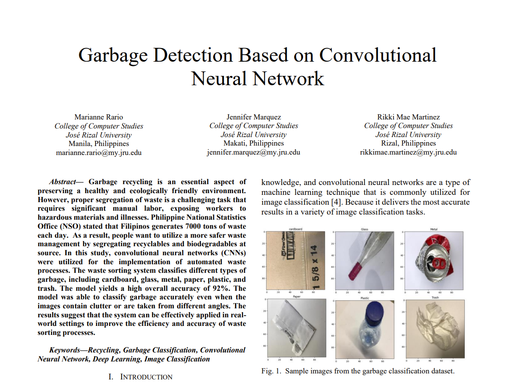

# EcoClassify - MobileNetV2 Garbage Classifier

This repository contains the code and implementation for a garbage classification deep learning system, originally built as a final project for an application of machine learning and deep learning course (ITC C508) and subsequently overhauled with a state-of-the-art **MobileNetV2** transfer learning model.

---

## Project Overview



* **Objective:** Automatically classify waste into 6 primary recycling categories: **Cardboard, Glass, Metal, Paper, Plastic, and Trash**.
* **Model Overhaul:** Replaced the legacy simple 32x32 grayscale CNN with a pre-trained **MobileNetV2** backbone (ImageNet weights) to support full color feature extraction and resolve real-world prediction errors.
* **Accuracy:** Achieves **83.18% overall accuracy** on a balanced, independent test set containing highly challenging real-world waste items.
* **Interactive Dashboard:** Runs a Flask web application with a drag-pan and zoom HTML5 canvas cropper to isolate waste items and eliminate background noise before classification.

---

## Augmented Dataset

To reduce model bias and handle real-world lighting, shapes, and transparency, we augmented the original dataset with compatible categories from the `omasteam/waste-garbage-management-dataset` on Hugging Face. 

* **Original Dataset:** Gary Thung's clean laboratory waste dataset (~2,527 images).
* **Augmented Dataset:** Balanced class distribution down to exactly **478 images per category** (Total: **2,868 images**), resolving under-representation issues.

---

## Built With

* **Backend Framework:** Flask (Python)
* **Deep Learning Library:** TensorFlow / Keras
* **Pre-trained Network:** MobileNetV2
* **Frontend:** Vanilla HTML5, CSS3 (Glassmorphism), JavaScript (Canvas API)

---

## Getting Started

To run the project locally, clone this repository and follow the setup instructions:

```bash
# Clone the repository
git clone https://github.com/SSJnihal/Computer-Vision-Mini-Project-Garbage-Classification.git

# Navigate into the project folder
cd Computer-Vision-Mini-Project-Garbage-Classification
```

For detailed setup, data preparation, training, and deployment steps, refer to [INSTRUCTIONS.md](file:///c:/Users/LENOVO/Documents/Projects/garbage-classification/INSTRUCTIONS.md).

### Quick Links
* **Locate Original Images:** [click here](Garbage/original_images)

---

## Data Preprocessing

During inference and training, the system executes the following preprocessing steps:
1. **Color Conversion:** Maintains full **RGB color** channels to retain vital hue information.
2. **Dimension Resizing:** Resizes images to **`224x224` pixels** (MobileNetV2 target input shape).
3. **Value Normalization:** Scales pixel values between **`[-1, 1]`** using the standard MobileNetV2 `preprocess_input` mapping.

---

## License

This project is [MIT](LICENSE) Licensed.
